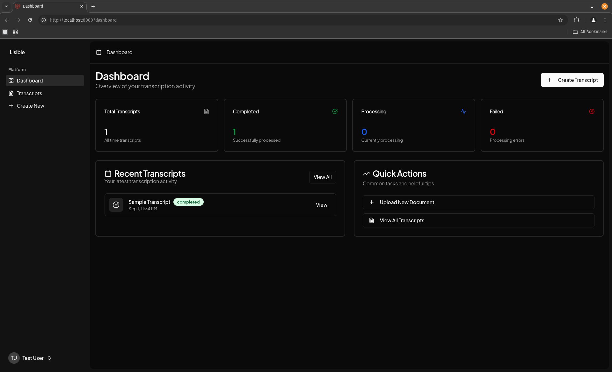

# Lisible

Turn messy prescriptions into clean, structured notes.

Lisible is a small, privacy-friendly web app that helps you read your doctor's handwriting. Upload a photo of a prescription or clinical note, and get a tidy, structured transcript you can actually use.

- Simple: drag-and-drop an image, get a result
- Private: runs locally with your own API key
- Useful: outputs structured data (patient, doctor, prescriptions, diagnoses, tests, notes)


## What it does

- Transcribes handwritten medical documents using Google's Gemini multimodal API
- Extracts key fields into a consistent JSON structure (meds, dosage, frequency, etc.)
- Tracks status (pending → processing → completed/failed) with clear errors and retry
- Lets you view, edit, and manage transcripts in a clean dashboard

## A few screenshots




## Quick start (local)

Prereqs:
- PHP 8.2+
- Composer
- Node 18+ (for Vite build) and npm
- A Google Gemini API key

1) Install dependencies
```fish
composer install
npm install
```

2) Configure your environment
```fish
cp .env.example .env
php artisan key:generate
```

3) Use the built-in SQLite database and run migrations/seeders
```fish
php artisan migrate:fresh --seed
php artisan storage:link
```

4) Add your Gemini credentials to `.env`
```dotenv
GEMINI_API_KEY=your_api_key_here
# optional
GEMINI_MODEL=gemini-2.5-flash
GEMINI_TIMEOUT=300
```

5) Start the app (backend, queue, logs, and Vite) — one command
```fish
composer run dev
```

Then open http://localhost:8000 and register/login. Go to “Transcripts → Create,” upload an image, and watch the status update in real time.


## Tech stack (friendly version)

- Laravel 12 (PHP) for backend, auth, queues, and API
- Svelte 5 + Inertia.js for a snappy, SPA-like UI
- SQLite by default for zero-config local setup
- Vite 6 for fast dev and builds
- Google Gemini PHP client for multimodal transcription

You can switch databases or front the app with Nginx easily—this repo keeps defaults simple so you can self-host quickly.


## Configuration

Key environment variables in `.env`:
- APP_URL=http://localhost
- DB_CONNECTION=sqlite
- QUEUE_CONNECTION=database
- SESSION_DRIVER=database
- FILESYSTEM_DISK=local (public disk is used for uploaded images)
- GEMINI_API_KEY=your_api_key_here
- GEMINI_MODEL=gemini-2.5-flash (default)
- GEMINI_TIMEOUT=300

Gemini config lives in `config/services.php` and pulls from `.env`.


## Running it your way

Separate processes (alternative to composer script):
- PHP server
```fish
php artisan serve
```
- Queue worker (required to process transcripts)
```fish
php artisan queue:work --verbose --tries=3 --queue=transcription
```
- Vite dev server
```fish
npm run dev
```

Build assets for production:
```fish
npm run build
```


## Deploying to a small VPS (outline)

- PHP-FPM + Nginx pointing to `public/`
- Configure `.env` (set `APP_ENV=production`, `APP_DEBUG=false`, DB of choice)
- Run: `composer install --no-dev --optimize-autoloader`
- Build assets locally or on the server: `npm ci && npm run build`
- Migrate DB and link storage: `php artisan migrate --force && php artisan storage:link`
- Start queue worker via systemd (example):
	- ExecStart=/usr/bin/php /var/www/lisible/artisan queue:work --queue=transcription --sleep=3 --tries=3 --timeout=300
- Ensure `storage/` and `bootstrap/cache/` are writable by the web user


## Troubleshooting

Where to look:
- App logs: `storage/logs/laravel.log`
- Transcription logs: `storage/logs/transcription.log`

Common issues:
- “Gemini API key is not configured…” → Set `GEMINI_API_KEY` in `.env`, then restart worker
- Jobs stay “pending” forever → Queue worker isn’t running. Start `php artisan queue:work`
- “Image file not found” → Uploaded file missing on public disk. Ensure `php artisan storage:link` and correct file permissions
- Parsing/JSON errors → Retry. If persistent, check the image quality and logs
- Timeouts → Increase `GEMINI_TIMEOUT` or ensure outbound network access


## Testing

Run the PHP test suite:
```fish
php artisan test
```


## Learn more / dig deeper

- Technical overview: `docs/TECHNICAL.md`

## License

Apache 2.0
